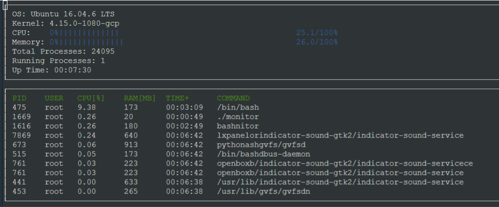

# CppND-System-Monitor

In this project, a linux system monitor similar to "htop" is created that reads system files to update system related information like OS name, kernel version , current CPU and memory utilization.
The code uses ncurses display library that is part of the starer code provided by Udacity for this project.
The program reads throught the system files periodically to display information about current running processes , like their process id, user who started the process, RAM & CPU consumption, time since the process was started and the command that launched the process.
Starter code for System Monitor Project in the Object Oriented Programming Course of the [Udacity C++ Nanodegree Program](https://www.udacity.com/course/c-plus-plus-nanodegree--nd213). 

## ncurses
[ncurses](https://www.gnu.org/software/ncurses/) is a library that facilitates text-based graphical output in the terminal. This project relies on ncurses for display output.

Install ncurses within your own Linux environment: `sudo apt install libncurses5-dev libncursesw5-dev`

## Make
This project uses [Make](https://www.gnu.org/software/make/). The Makefile has four targets:
* `build` compiles the source code and generates an executable
* `format` applies [ClangFormat](https://clang.llvm.org/docs/ClangFormat.html) to style the source code
* `debug` compiles the source code and generates an executable, including debugging symbols
* `clean` deletes the `build/` directory, including all of the build artifacts

## Instructions

1. Clone the project repository: `git clone https://github.com/ManikandaBalajiVenkatesan/udacity_c_plus_plus_nano_degree.git`

2. Get into CppND-System-Monitor

3. Build the project: `make build`

4. Run the resulting executable: `./build/monitor`

