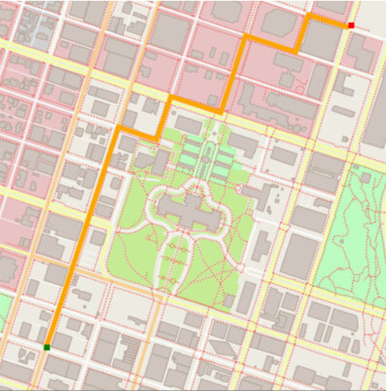

# Udacity C++ Nano Degree

This repository contains the projects that I did as part of C++ Nano degree at Udacity. 
The course consists of 4 modules and at the end of every module a project based on the module topic was done.
After completion of 4 modules and 4 projects , I did a capstone project that puts into practice the concepts learnt during the course work.

* **Fundamentals**
  * Vectors & arrays 
  * Reading and writing from files
  * Control structures
  * Pointers & references
  * Structs & Enums
  * Call by value vs Call by Reference
  * Project - Astar route planning
  
  
  
* **Object Oriented Programming**
  * Classes
  * Encapsulation & Abstraction
  * Inheritance
  * Composition
  * Polymorphism
  * Virtual functions
  * Templates
  * Project - Linux System Monitoring
  
  
  
* Memory Management
  * Types of computer memory
  * Stack vs Heap memory, how to create and utilize them
  * Dynamic Memory allocation 
  * Lvalues and Rvalues
  * Move semantics
  * Copy semantics
  * Smart Pointers - unique, shared, weak
  * Smart Pointers - transferring ownership
  * Project - Memory optimization of chatbot application
  
  
  
* Concurrency
  * Running multiple threads.
  * Promises and futures
  * Data race and prevention
  * Mutex to protect shared memory
  * Locks to avoid deadlocks
  * Concurrent message queue 
  * Project - Traffic simulation through concurrent programming
  
  
  
* Capstone Project
  For this I developed a classic ping pong game using the snake game starter code provided by Udacity and it uses various OOP concepts extensively.
  
  
The code and detailed explanation of each project can be found inside their respective repos.

